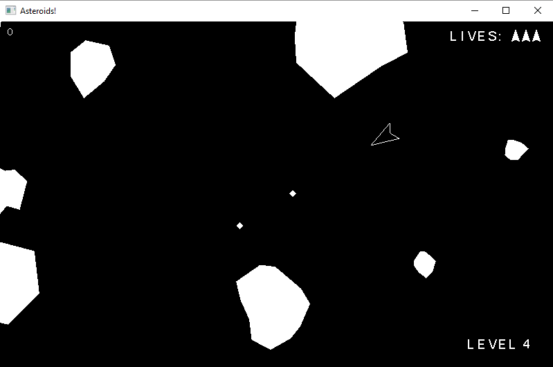

Asteroids game created in the course "Intro To Computer Graphics and Animation" during my 3rd year at Dalhousie University.

Includes a pre-compiled .exe file that should allow the game to be played.

Implemented with C and OpenGL.

•	Turn the ship with the left and right arrow keys
•	Use the up arrow key to accelerate
•	Use the down arrow key to come to a stop
•	Ship retains momentum and gradually slows down when not accelerating
•	The ship and asteroids loop around when they go outside the screen
•	Press space to fire a photon projectile to destroy asteroids
•	You have three lives; if you die three times in a level it's game over
•	There are 7 levels
•	Larger asteroids break into two when destroyed, creating particles
•	The ship breaks into pieces when it is destroyed
•	Collision detection with asteroids is done with a point-polygon test, and works well
•	Distance between photons or the ship and asteroids is used as bounding
	o	(Proper collision detection is not done until a certain proximity)
•	 Photon-asteroid collisions are done with just the center point of the photon
	o	Not ideal, but works fine
•	"Cheat" commands are enabled for testing purposes:
	o	'w' allows you to instantly "win" a level
	o	'1', '2' and '3' spawn additional asteroids of the respective sizes
•	Score counter in the top left
•	Animated text
